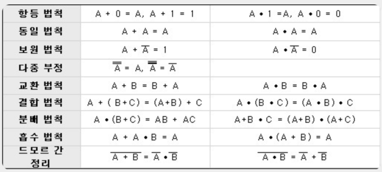

### 논리회로
    - AND,OR,NOT과 같은 논리 연산에 따라 동작을 수행하는 논리소자들을 사용하여 구성
    - 조합논리회로
        - 회로의 출력 값이 입력 값에 의해서만 정해지는 논리회로, 기억능력x
    - 순서논리회로
        - 출력 값이 내부 상태와 입력에 따라 정해지는 논리회로, 기억능력o
### 게이트
    - AND (A•B) 입력 신호가 모두 1 일 때 1 출력
    - OR (A+B) 입력 신호 중 1개만 1이어도 1 출력
    - NOT(!A) 입력된 정보를 반대로 변환하여 출력
    - BUFFER(A=B) 입력된 정보를 그대로 출력
    - NAND AND의 부정 , 모두 1이면 0 출력
    - XOR 입력되는 것이 모두 같으면 0, 다르면 1
    - XNOR XOR의 부정
### 반가산기, 전가산기
    - 순서논리회로
        - RS 플립플롭
        - JK 플립플롭
        - D 플립플롭
            - 그대로 
        - T 플립플롭
            - 0 -> 불변 , 1 -> 0 으로
### 불대수
    - 논리회로 간소화를 위해 사용하는 논리식

### 순서논리회로의 기본
    - RAM : 현재 수행중인 프로그램 일시적으로 저장, 휘발성
        - SRAM : 전원 공급되는 동안 내용 기억, 속도 빠름
        - DRAM : 전원 공급되더라도 일정 시간 지나면 휘발, 용량 작음
### 비수치적 데이터 표시법
    - BCD -> 6bit -> 기본코드, 대소문자 구별 못함
    - ASCII -> 7bit -> 통신용, 개인용 컴퓨터에서 사용
    - EBCDIIC -> 8bit -> 범용, 대소문자 구별, 16진수
### 프로세서 수행 과정
    - 명령어 인출 -> 해석 -> 데이터 인출 -> 처리 -> 쓰기
### 연산장치
    - 비수치적 연산
        - Shift : 모든 비트들을 서로 이웃한 자리로 옮기는 것  0 0 1 0 왼Shift 0 1 0 0 / 오Shift 0 0 0 1
### 조합회로의 최소화
    1. 도시법
        - 서로 이웃한 '1'들을 묶는다.
        - 변하지 않는 변수를 찾는다.
        - 같은 묶음의 변수들은 곱으로, 다른 묶음은 합으로 연결한다.