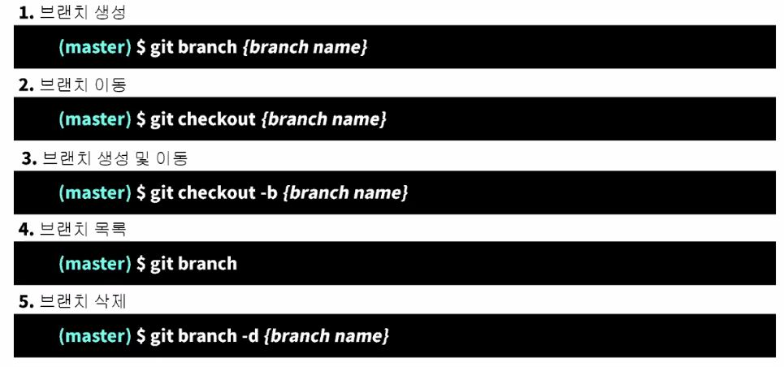

# git [분산 버전관리 시스템]

- **깃 버전확인**

  `git --version`

- **위치 이동, 폴더 목록**

  `cd <path> ` , `cd..`, `ls 파일 목록보기`

- **폴더생성 , 삭제**

  `mkdir <폴더명>`

  `rm <삭제파일명>`  폴더를 지우고 싶으면 `rm -r <폴더명>`

- **텍스트 파일 생성**

  `touch <텍스트파일명>`

## Commit 과정

- ***git init (로컬 저장소 생성)>  untracked 상태 > git add > staging Area에 올리고 > git commit > committed 수정하면 다시 untracked > git add > staging Area > ...***

- **저장소 생성**

  `git init` **remote 에서 repo 생성 후 clone 하면 `git init`  수행하지 않아도 된다.**
  
  **`폴더 내의 .git 생성 `**

- **commit**

  `git add. > git commit -m "커밋메세지"`

- **push (깃허브 업로드)**

  `git push -u(어디로) origin master(무엇을)` *//최초 push -u*

## git 명령어

- **git log** > `커밋 히스토리`

  `git log --graph --oneline`  > branch 변경 사항 

- **git init** > `로컬 저장소`

- **git status** > `현재 git으로 관리되고 있는 파일들의 상태를 알 수 있다.`

- **git remote add origin(으로) remote_repo**

- **git clone{remote_repo(깃주소)) - git repository에 있는 저장소를 local로 복사 **

  `클론하면 바탕화면에 클론한 레포지토리와 같은 폴더 생성`

  `빈 레포지터리 생성  - 클론 - vs code로 폴더열기  ` 

# git day02

- **로컬 저장소를 만들고 연결하고 push 하는 방법**

  `폴더 생성 > git init 저장소 생성 > 폴더 내 파일 생성 > git add > git commit >`

  `git hub 레포지토리 생성 후 주소 복사 > git remote add origin 주소 > git push`

- **집  > 강의장**

1. ` 강의장 폴더 > vscode 터미널 > clone [레포지토리 주소.git]`
2. `폴더 > git clone remote_url. git. (현재폴더에 clone)`

- **add 이전 단계로 (staging area) 되돌리기**

  `git restore --staged README.md`

- **가장 최신 상태로 restore**

  `git restore {파일명}`

- **commit 이전상태로**

   `git reset --hard {commit ID: 하나의 레포지토리이면 4자리}`

- soft ? mixed? 

- **git ignore**

  `*.gitignore`

  ***data.scv # 특정파일   secret/ # 특정 폴더    .png # 특정 확장자   !profile.png # 제외***

### branch

- `특정 commit을 가르키는 포인터`

- `git checkout [branch ex)master]`

- `git merge  [합칠 브런치] ` *※ 위치 - 최종 결과를 출력할 브런치에서*
- **`clone`**   타인의 remote > local
- **`fork`**     타인의 remote > 나의 remote  

- git reset git rebase 

